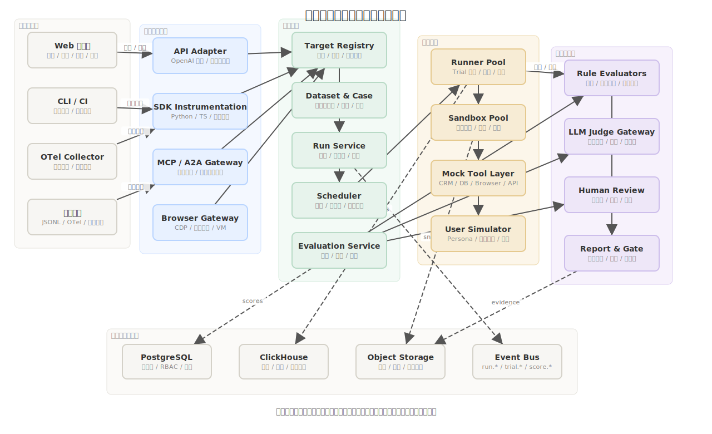

# 智能体接入与运行测评技术实现方案

更新日期：2026-06-11  
适用范围：Agent 评测平台的被测对象接入、运行编排、轨迹采集、评分聚合、报告门禁与数据回流。

## 1. 目标与设计边界

本方案解决两个工程问题：

- 客户已有智能体如何低成本接入平台，并在不破坏其现有研发流程的前提下获得可复现评测。
- 平台如何运行多次、可追溯、可重评的 Agent 测评，并把结果转化为发布门禁、问题定位和数据生产任务。

平台不假设客户会采用唯一 Agent 框架，也不要求一开始改造生产代码。接入层必须同时支持 API、离线轨迹、SDK 埋点、MCP/A2A 协议中介、浏览器或电脑操作沙箱。运行层必须把“执行轨迹”和“评估打分”解耦，保证历史轨迹可以用新的评估器重新评分。

## 2. 技术框架图



框架分为六层：

- 入口与触发：Web 控制台、CLI/CI、OpenTelemetry Collector、离线轨迹上传。
- 智能体接入层：API Adapter、SDK Instrumentation、MCP/A2A Gateway、Browser Gateway。
- 控制平面：Target Registry、Dataset & Case、Run Service、Scheduler、Evaluation Service。
- 执行平面：Runner Pool、Sandbox Pool、Mock Tool Layer、User Simulator。
- 评估与治理：规则评估器、终态校验、LLM Judge Gateway、Human Review、Report & Gate。
- 数据与事件底座：PostgreSQL、ClickHouse、Object Storage、Event Bus。

关键原则：

- 执行与评估解耦：Trial 先产出 Trajectory，评分服务异步消费轨迹，历史轨迹可重评。
- 版本化不可变：Target、Dataset、Case、Environment、Evaluator、Judge Prompt、Run Config 都写入版本快照。
- 工具副作用隔离：工具调用进入 Mock Tool Layer 或 Sandbox，真实系统只通过受控代理暴露。
- 报告可下钻：Metric 聚合结果必须能回到 Case、Trial、Step、截图、工具参数和评估证据。

## 3. Agent 接入实现方案

### 3.1 Target Registry

Target 是一个可复现的被测智能体版本。平台保存：

- 基础信息：名称、业务域、负责人、版本号、标签、风险等级。
- 运行配置：模型、Prompt 指纹、Agent 框架、工具清单、运行时参数、并发限制。
- 接入配置：接入模式、端点、协议版本、请求映射、响应解析、健康检查样例。
- 安全配置：凭据引用、密钥策略、租户隔离、出网策略、工具白名单。
- 版本快照：每次可影响结果的配置变更都生成新 Target Version。

Target Registry 只存凭据引用，不直接存明文密钥。运行时由 Runner 通过 Vault 或客户 VPC 密钥代理换取短期凭据。

### 3.2 API 接入

API 模式适合已经有 HTTP 服务或 Agent 网关的客户。

实现要点：

- 支持 OpenAI Chat Completions 兼容请求，也支持自定义 HTTP 映射模板。
- 请求模板包含 URL、Method、Header、Body 映射、会话 ID 透传、超时、重试和流式开关。
- 响应解析器抽取 final answer、tool call、tool result、token、latency、error。
- 健康检查使用小样例发起 dry run，展示原始响应、解析结果和轨迹结构。
- Runner 对被测端点做并发限流，避免评测流量压垮客户服务。

API 模式的优势是最快上线；缺点是如果客户端没有返回工具调用或中间状态，轨迹完整度依赖其响应结构。

### 3.3 离线轨迹上传

离线轨迹适合客户不愿改造生产代码、或者数据不能离开自有执行环境的场景。

实现要点：

- 支持 JSONL 批量上传，每行一条 Trial 或一段会话轨迹。
- 支持 OpenTelemetry GenAI 语义约定的 span/event 转换为平台 Trajectory。
- 上传前提供 schema 校验器，错误要精确到行号、字段、期望类型和修复建议。
- 允许客户先只上传 input/output，后续逐步补充 tool call、latency、token、screenshot、state delta。
- 上传成功后进入 Evaluation Queue，只打分不驱动执行。

离线轨迹是获客入口，价值在于客户无需接入平台 Runner 就可以获得统一评估、报告和数据回流能力。

### 3.4 SDK 埋点接入

SDK 模式适合需要持续回归、CI 门禁和完整轨迹的研发团队。

实现要点：

- 提供 Python 与 TypeScript SDK。
- 自动捕获 LLM 调用、工具调用、工具返回、用户消息、Agent 间消息、自定义事件、异常、token、延迟。
- 对 LangGraph、LangChain、AutoGen、OpenAI Agents SDK、CrewAI 等框架提供适配器；自研框架使用手动 span API。
- SDK 既能发送到平台 Collector，也能发送到客户已有 OpenTelemetry 后端。
- SDK 支持评测模式：平台下发 Case 输入和环境引用，SDK 驱动本地 Agent 执行并回传轨迹。

推荐最小初始化形态：

```python
from agent_eval import EvalClient

client = EvalClient.init(
    target="support-agent",
    version="2026.06.11",
    endpoint="https://eval.example.com/otel",
)

with client.trial(case_id="case_1024") as trial:
    result = support_agent.run(trial.input)
    trial.finish(result)
```

### 3.5 MCP 工具中介接入

MCP 模式适合平台需要接管工具调用、记录工具轨迹、替换真实工具为 Mock 工具的场景。

实现要点：

- 平台作为 MCP Server 暴露工具，或作为代理转发到客户 MCP Server。
- 工具 schema、权限、Mock 规则、返回延迟、错误注入策略写入 Environment Version。
- Tool Call 统一写入 Trajectory Step，包括 tool name、arguments、result、error、latency、side effect summary。
- 高风险工具调用需要 human approval 或 policy checker。
- 对同一个 Case，多次 Trial 使用相同环境快照和 Mock 数据种子。

这种接入方式的技术价值在于：即使被测 Agent 自身不可完全改造，平台也能在工具边界获得结构化证据。

### 3.6 A2A 与多智能体接入

A2A 模式适合客户把不同团队或不同语言实现的 Agent 作为远程服务连接。

实现要点：

- 平台保存远程 Agent 的 agent card 或等价能力描述。
- A2A Gateway 作为 User Simulator、Peer Agent 或 Evaluation Harness 与被测 Agent 通信。
- 每条消息都映射为 Trajectory Step，包含 sender、receiver、role、content、artifact、task state。
- 对多 Agent 任务，Report 同时展示全局成功率和各 Agent 的责任归因。

A2A 不适合高频、低延迟、共享内存的内部子模块。平台应把 A2A 定位为跨服务、跨团队、跨框架的契约边界。

### 3.7 Browser / Computer Use 接入

Browser Gateway 用于浏览器操作、桌面操作、网页任务、后台系统流程等可执行环境。

实现要点：

- 每个 Trial 创建独立浏览器上下文或 VM 快照。
- 平台记录截图、DOM 快照、CDP 事件、鼠标键盘动作、文件变更、网络请求。
- 终态校验器使用 Playwright 断言、数据库状态比对、文件哈希、业务 API 查询等方式判定成功。
- 对危险动作使用 Mock 后端或沙箱数据，禁止直接操作生产系统。

Agent 评测区别于普通文本评测的核心壁垒，就在于可控环境和终态校验，而不仅是问答打分。

## 4. 运行测评主链路

### 4.1 Run 创建

Run 绑定以下不可变输入：

- Dataset Version
- Target Version
- Evaluator Set Version
- Environment Version
- Run Config：重复次数、并发度、超时、预算、重试策略、门禁策略、抽样策略

Run Service 校验版本完整性后生成 Run Snapshot。Snapshot 写入 PostgreSQL，配置摘要写入 Report，便于审计和复跑。

### 4.2 Trial 计划生成

Planner 将 Dataset 中每个 Case 展开为 N 个 Trial：

```text
Run = Dataset Version × Target Version × Evaluator Set × Config
Trial Plan = Case × repeat_index × environment_seed × evaluator_scope
```

Trial 具有幂等键：

```text
trial_key = hash(run_id, case_id, repeat_index, target_version, env_version)
```

幂等键保证 Worker 宕机或消息重复时不会产生重复结果。

### 4.3 Scheduler 与 Runner

Scheduler 负责：

- 租户级配额与优先级队列。
- CI 门禁运行优先级高于探索运行。
- 对被测 Agent、Judge 模型、沙箱资源分别限流。
- 预算熔断：达到 token、金额或耗时上限时暂停并生成部分报告。

Runner 负责：

- 拉取 Trial Plan。
- 初始化环境和 Mock 工具。
- 调用被测 Agent。
- 采集 Trajectory。
- 标记执行状态：completed、agent_error、infra_error、timeout、budget_stopped、cancelled。

### 4.4 Trajectory 采集

Trajectory 是有序 Step 序列：

```json
{
  "trajectory_id": "traj_01",
  "trial_id": "trial_01",
  "steps": [
    {
      "index": 1,
      "type": "user_message",
      "content": "帮我修改订单地址",
      "timestamp": "2026-06-11T10:01:12+08:00"
    },
    {
      "index": 2,
      "type": "tool_call",
      "tool": "crm.lookup_order",
      "arguments": {"order_id": "A1024"},
      "latency_ms": 482
    },
    {
      "index": 3,
      "type": "tool_result",
      "tool": "crm.lookup_order",
      "result_ref": "obj://trial_01/tool_result_03.json"
    }
  ]
}
```

大型字段、截图、附件和完整工具返回进入 Object Storage；ClickHouse 存检索和聚合需要的列式明细；PostgreSQL 存元数据和关系。

### 4.5 评分与重评

Evaluation Service 异步消费 Trial 完成事件：

- 规则型评估器：结构化断言、字段匹配、正则、JSON Schema、SQL 查询。
- 终态校验器：代码测试、浏览器断言、数据库状态、文件状态、业务 API 状态。
- 轨迹评估器：工具选择、参数正确性、错误恢复、越权调用、步骤冗余。
- LLM Judge：语义质量、任务完成度、安全性、可解释性、对话体验。
- 人工评估：金标准建立、低置信样例、裁判冲突、专家域任务。

评估器输出统一 Score：

```json
{
  "score_id": "score_01",
  "evaluator_version": "tool_argument_checker@2026.06.11",
  "scope": "step",
  "value": 0,
  "label": "failed",
  "reason": "工具参数使用了旧地址字段",
  "evidence_ref": {
    "trajectory_id": "traj_01",
    "step_index": 2,
    "field": "arguments.address"
  }
}
```

因为执行与评分解耦，新评估器发布后可以对历史 Trajectory 发起 re-score，不需要重新调用被测 Agent。

## 5. 多次运行结果偏差处理

Agent 非确定性来自模型采样、工具延迟、上下文状态、外部 API、并发竞争和 Judge 波动。平台不能用单次分数代表质量，必须把偏差纳入产品机制。

### 5.1 重复试验

每个 Case 默认运行 N 次。报告同时展示：

- pass@1：单次成功率。
- pass@k：k 次中至少一次成功的能力上限。
- pass^k：连续 k 次全部成功的稳定性指标。
- mean / variance：均值与方差。
- confidence interval：置信区间。
- flaky rate：同一 Case 多次结果不一致的比例。

上线门禁优先看 pass^k、置信区间和关键标签失败，而不是只看平均分。

### 5.2 环境固定

为了把 Agent 波动和环境波动分离：

- Dataset Version 固定。
- Environment Version 固定。
- Mock Tool 数据固定。
- User Simulator 剧本固定。
- 外部 API 用录制回放或代理缓存。
- Sandbox 每个 Trial 从同一快照重置。
- 对支持 seed 的模型和采样器记录 seed；不支持时记录模型版本、温度、top_p、系统指纹。

### 5.3 失败归因分层

Trial 失败不直接等于 Agent 失败。平台至少区分：

- agent_failure：被测对象给出错误答案、错误工具、越权动作、未完成任务。
- infra_failure：Runner、网络、沙箱、Collector、存储、队列异常。
- environment_failure：环境初始化失败、Mock 工具配置错误、终态校验器不可用。
- judge_failure：评估器超时、裁判冲突、裁判健康度不足。
- ambiguous：证据不足，需要人工复核。

报告中的质量指标默认排除 infra_failure，但必须单独展示基础设施稳定性，避免平台把自己的问题算到客户 Agent 上。

### 5.4 复跑策略

复跑不是简单全部重跑：

- infra_failure 自动复跑，最多重试固定次数。
- flaky case 进入稳定性审计队列，提高重复次数。
- 关键业务标签失败触发 targeted rerun。
- Judge 冲突触发人工抽检或更高等级裁判。
- 修复验证只复跑受影响标签、失败簇和门禁核心集。

### 5.5 统计门禁

门禁建议采用组合规则：

```text
通过条件 =
  关键标签 pass^3 不低于阈值
  且 新增关键失败数 = 0
  且 相对基线没有显著退化
  且 Judge 健康度满足门禁资格
  且 infra_failure_rate 低于平台可接受阈值
```

当置信区间跨过门禁阈值时，平台应给出“不确定，需要增加样本或人工复核”，而不是强行通过或阻断。

## 6. 客户价值与自建比较

客户当然可以自建基础评测框架，但多数客户很难在短时间内自建完整闭环。平台的主要价值不是“能跑几条 eval”，而是把评测变成可复用、可治理、可审计、可接入研发流程的基础设施。

### 6.1 平台对客户的主要价值

- 缩短接入时间：API、轨迹上传、SDK、MCP/A2A、浏览器沙箱覆盖不同成熟度客户。
- 提升上线可信度：重复试验、置信区间、pass^k、基线对比和门禁规则降低单次结果误判。
- 降低问题定位成本：分数能下钻到轨迹步骤、工具参数、终态截图和评估证据。
- 沉淀评测资产：Case、环境模板、Mock 工具、Rubric、Judge、金标准轨迹可以复用，而不是每次项目重新做。
- 打通研发流程：CI 门禁、夜间回归、线上轨迹回流和发布报告进入日常工程节奏。
- 支持第三方可信交付：审计日志、证据包、裁判治理和人工仲裁让结果可以对业务、合规或客户交付。
- 形成数据飞轮：失败簇可以直接转化为样例、金标准轨迹、偏好数据、红队样本和训练导出。

### 6.2 为什么客户未必愿意完全自建

自建会遇到七类成本：

- 协议适配成本：不同 Agent 框架、工具协议、浏览器任务、离线轨迹格式都要维护。
- 环境工程成本：沙箱、Mock 工具、快照重置、终态校验、浏览器集群不是普通 CRUD 系统。
- 统计与门禁成本：重复试验、flaky 判定、置信区间、基线比较需要产品化解释。
- 裁判治理成本：LLM Judge 的金标准、一致率、偏差、升级、排除和审计需要持续运营。
- 数据资产成本：评测集构建、标签体系、污染检测、低区分度样例淘汰需要长期维护。
- 合规安全成本：PII 脱敏、租户隔离、密钥治理、审计、私有化部署会放大实施复杂度。
- 组织协同成本：研发、平台、业务、标注、合规和外部专家需要同一套对象模型和证据链。

因此平台应允许客户自带部分组件：客户可以保留已有观测系统、已有 CI、已有 Agent 网关和自有数据环境；平台提供统一评测控制平面、轨迹规范、评估治理和报告门禁。

## 7. 核心服务拆分

建议服务拆分如下：

| 服务 | 职责 | 核心存储 |
| --- | --- | --- |
| Target Service | 被测对象注册、版本、接入配置、健康检查 | PostgreSQL |
| Dataset Service | 数据集、样例、标签、快照、导入导出 | PostgreSQL + Object Storage |
| Environment Service | 沙箱模板、Mock 工具、终态校验器、快照 | PostgreSQL + Object Storage |
| Run Service | Run 状态机、Trial Plan、幂等、预算 | PostgreSQL + Redis |
| Scheduler | 队列、租户配额、优先级、限流 | Redis / Kafka |
| Runner | 执行 Trial、调用 Agent、采集轨迹 | ClickHouse + Object Storage |
| Evaluation Service | 评分、重评、聚合、门禁输入 | ClickHouse + PostgreSQL |
| Judge Gateway | 裁判路由、Prompt 版本、成本、健康度 | PostgreSQL + Object Storage |
| Review Service | 人工复核、金标准、仲裁、校准任务 | PostgreSQL |
| Report Service | 报告、对比、证据包、CI 状态回写 | PostgreSQL + Object Storage |
| Data Loop Service | 失败簇、工单、训练数据导出、验证运行 | PostgreSQL + Object Storage |

## 8. 关键数据模型

```text
Tenant
 ├─ Target
 │   └─ TargetVersion
 ├─ Dataset
 │   └─ DatasetVersion
 │       └─ CaseVersion
 ├─ Environment
 │   └─ EnvironmentVersion
 ├─ Evaluator
 │   └─ EvaluatorVersion
 └─ Run
     ├─ Trial
     │   └─ Trajectory
     │       └─ Step
     ├─ Score
     ├─ Metric
     ├─ Report
     └─ GateDecision
```

必须有不可变快照的对象：

- TargetVersion
- DatasetVersion
- CaseVersion
- EnvironmentVersion
- EvaluatorVersion
- JudgePromptVersion
- RunConfigSnapshot

可变对象：

- Review Task 状态
- Gate 审批状态
- Data Work Order 状态
- Judge Health
- Report 注释与人工复核结论

## 9. API 与事件设计

### 9.1 外部 API

```http
POST /v1/targets
POST /v1/targets/{target_id}/versions
POST /v1/targets/{target_version_id}/health-check

POST /v1/datasets
POST /v1/datasets/{dataset_id}/versions
POST /v1/cases/import

POST /v1/runs
GET  /v1/runs/{run_id}
POST /v1/runs/{run_id}/cancel
POST /v1/runs/{run_id}/rerun

POST /v1/traces/upload
GET  /v1/trajectories/{trajectory_id}

POST /v1/re-score
GET  /v1/reports/{report_id}
POST /v1/gates/{gate_id}/approve
```

### 9.2 事件总线

```text
target.version.created
dataset.version.created
run.created
trial.planned
trial.started
trajectory.step.appended
trial.completed
trial.failed
score.completed
metric.aggregated
report.ready
gate.decided
review.task.created
data_work_order.created
```

事件必须包含 tenant_id、correlation_id、run_id、trace_id、producer、schema_version 和 occurred_at。

## 10. 安全、治理与合规

安全设计要从第一版进入架构：

- 租户隔离：数据、对象存储路径、队列、密钥和审计日志按租户隔离。
- 凭据治理：凭据只存引用；Runner 获取短期 token；所有访问写审计。
- PII 脱敏：线上轨迹进入评测集前必须经过自动脱敏和人工抽审。
- 工具权限：高风险工具默认走 Mock；真实工具需要白名单、审批和最小权限。
- 裁判网关：Judge Prompt 版本化，裁判调用记录成本、输入摘要、输出、错误和健康状态。
- 证据包：报告可导出 Run Snapshot、Dataset Snapshot、Target Snapshot、Evaluator Snapshot、审计日志和关键轨迹。

## 11. 分阶段建设建议

### 第一阶段：可用的评测控制平面

- Target Registry
- Dataset Version
- API 接入
- 离线轨迹上传
- Run / Trial / Trajectory 数据模型
- 基础规则评估器与 LLM Judge
- 重复试验和报告下钻

### 第二阶段：进入研发流程

- SDK 埋点
- CI 门禁
- Scheduler 配额与预算熔断
- Judge 校准
- 失败簇和数据工单
- 线上轨迹回流

### 第三阶段：形成平台壁垒

- MCP/A2A Gateway
- Browser / Computer Use 沙箱
- 环境模板市场
- 终态校验器库
- 人工专家复核运营台
- 第三方报告与证据包
- 训练数据导出与验证运行闭环

## 12. 验收指标

技术验收建议：

- 新 Target API 接入到首次运行小于 15 分钟。
- 1,000 条离线轨迹上传后 schema 校验错误可定位到行级和字段级。
- 1,000 Case × 3 Trial 的回归运行在资源充足时 30 分钟内完成。
- 轨迹采集丢失率低于 0.1%，基础设施失败与 Agent 失败分开统计。
- 历史 Trajectory 可被新 Evaluator 重评，且无需重新调用被测 Agent。
- 报告中的任何聚合指标都可下钻到 Case、Trial、Step 和 evidence_ref。
- 门禁报告默认展示置信区间、pass@k、pass^k、flaky rate 和基线对比。
- Judge 低于健康阈值时不能作为阻断发布的唯一依据。

## 13. 外部技术依据

检索日期：2026-06-11。以下依据用于协议和兼容层设计，不代表平台绑定单一供应商实现。

- OpenTelemetry 官方 GenAI 语义约定：定义 GenAI 操作的 events、metrics、model spans、agent spans 等信号；页面标注 GenAI 语义约定仍处于 Development/过渡状态，因此平台应保存 schema_version 并支持版本迁移。  
  https://opentelemetry.io/docs/specs/semconv/gen-ai/
- OpenTelemetry 官方 GenAI agent/framework spans：包含 agent creation、agent invocation、workflow、tool execution 等 span 方向，适合作为 SDK 埋点和轨迹标准化的参考。  
  https://opentelemetry.io/docs/specs/semconv/gen-ai/gen-ai-agent-spans/
- Model Context Protocol 官方规格：MCP 是用于 LLM 应用与外部数据源、工具和工作流集成的开放协议，规格以日期版本发布，并基于 JSON-RPC、能力协商和 client/server 结构。  
  https://modelcontextprotocol.io/specification/2025-11-25
- MCP Tools 官方规格：MCP Server 可暴露可被模型调用的工具，工具包含唯一名称与 schema，适合作为平台 Mock Tool Layer 和工具调用证据采集的协议参考。  
  https://modelcontextprotocol.io/specification/2025-11-25/server/tools
- Google ADK A2A 文档：A2A 适用于远程 Agent、跨服务、跨团队、跨语言或需要正式通信契约的场景；不适合高频低延迟的本地子模块。  
  https://adk.dev/a2a/intro/
- Google ADK A2A quickstart：远程 Agent 需要 agent card 描述能力，平台可将该机制映射为 Target 能力描述与健康检查输入。  
  https://adk.dev/a2a/quickstart-consuming-go/
